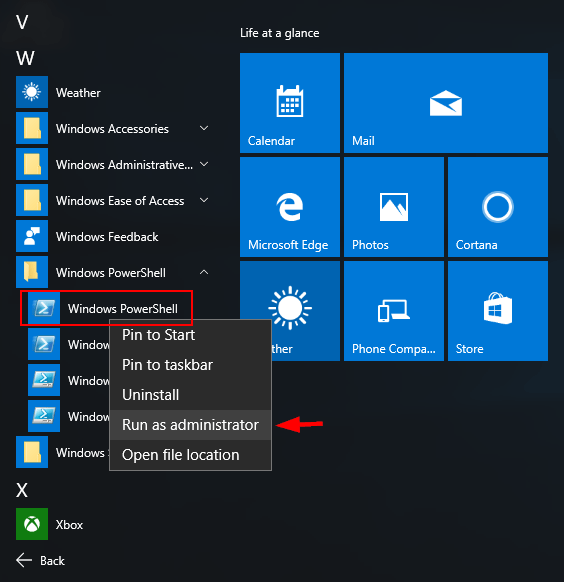

# Instalação de Requisitos no Ambiente Local
Para abstrair a complexidade de instalação e configurações foi desenvolvido scripts que automatizam a instalação e configuração de softwares no Windows.

Os seguintes processos de instalação e configurações são realizados:
- Instala o PowerShellGet (para instalar módulos powershell)
- Instala o Git
- Instala o Chocolatey
- Instala o dotnetfx
- Instala o Python
- Instala o ojdkbuild8
- Instala o  Winrar
- Instala o VS Code
- Instala o sql-server-management-studio (SSMS)
- Instala o powerBI Desktop
- Instala o azure-cli
- Instala o Microsoft Monitoring Agent
- Instala o terraform
- Instala o tflint (linter para terraform)
- Instala o Google Chrome
- Instala o SSDT
- Faz o download, configura as variáveis de ambiente e executa testes para o Data Integration (Kettle)
- Faz o download e abre o On-premises Data Gateway
- Faz o download e abre o driver do banco de dados
- Gera uma bat para deletar os logs do Data Integration
- Gera os arquivos de jobs e transformations do Data Integration

Siga o passo-a-passo abaixo para executar corretamente a automação:

1. Execute o PowerShell como **admin** e abra o diretório do usuário:
<br/>



<br/>

```powershell
cd ~
```

2. Clone o projeto principal 

NOTA: o projeto principal segue um padrão de nomenclatura: <NOME_PRODUTO>-<NOME_CLIENTE>  

```powershell
git clone url
```

3. Clone este repositório dentro projeto principal.
```powershell
cd <PROJETO_PRINCIPAL>\infra\local`.
git clone url
```

4. Cole o comando abaixo no powershell para conceder permissão de execução de scripts.
````powershell
Set-ExecutionPolicy -ExecutionPolicy Unrestricted -Scope CurrentUser -Force
````

5. No powershell, digite
```powershell
PowerShell -ExecutionPolicy Bypass `
    .\run.ps1 `
    -project_name $project_name `
    -data_source $data_source | Tee-Object -FilePath C:\Users\$env:username\log_installation.log -Append

```

ex: `PowerShell -ExecutionPolicy Bypass .\run.ps1 -project_name PRODUCT_NAME-mpxx -data_source oracle`

- A partir de agora a instalação automatizada vai começar. Toda a saída pode ser acompanhada no arquivo de log `log_installation.log`
- Alguns programas, para serem instalados, exigem que o sistema operacional seja reiniciado. Caso isso aconteça, execute os passos 2, 3 e 4 novamente.

5. Por fim, o Data Integration executará testes na máquina. Será aberto duas telas conforme imagem abaixo. Basta clicar em OK.


## Instalações Manuais no Ambiente Local
- On-premises Data Gateway
- Data Base Drivers

Por questões de segurança e limitações alguns programas devem ser instalados e configurados manualmente.
1. Instale o on-premises data gateway.  **O instalador será aberto automaticamente**.
2. Instale os drivers do banco de dados. O instalador será aberto automaticamente. Veja no arquivo de documentação para saber mais detalhes sobre as configurações.

#### On-premises Data Gateway
1. Aguarde abrir a janela do instalador do Data Gateway. Em seguida, selecione **Next**.


<br/>

2.	Selecione Gateway de dados local (recomendado), que é o modo padrão e, em seguida, selecione **Next**.


<br/>

3.	Leia os termos de uso e privacidade e aceite os termos de uso. Em seguida ,selecione **Install**.


<br/>

4.	Depois que o gateway for instalado com êxito, forneça o endereço de email, em seguida, selecione entrar:


**NOTA**: é importante que seja utilizado a mesma conta que será criado os recursos de cloud.

<br/>

5.	Selecione registrar um novo gateway neste computador e clique em **Next**. Essa etapa registra a instalação do gateway com o serviço de nuvem do gateway.


<br/>

6.	Forneça estas informações para a configuração do data gateway:
- Um nome de gateway que é exclusivo em seu locatário do Azure AD (recomendado: <nome_produto>-<nome_cliente>-onpremisesgw)
- A chave de recuperação, que deve ter pelo menos oito caracteres, que você deseja usar.
- Confirmação para a chave de recuperação


<br/>

7.	Configure a região que o gateway deve apontar e o barramento de serviço do Azure que é usado pela instalação do seu gateway. É recomendado usar Brazil Sounth.


<br/>

1. Examine as informações na janela de confirmação final. Este exemplo usa a mesma conta para aplicativos lógicos, Power BI, PowerApps e Microsoft Flow, portanto, o gateway está disponível para todos esses serviços. Quando estiver pronto, selecione fechar.


---
