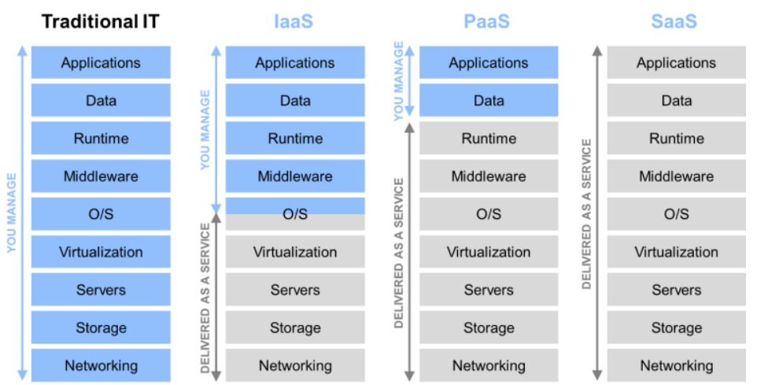
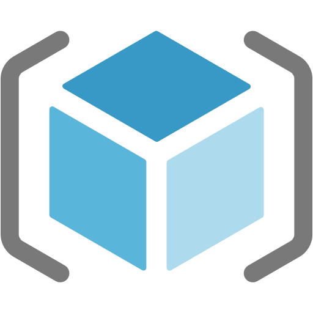
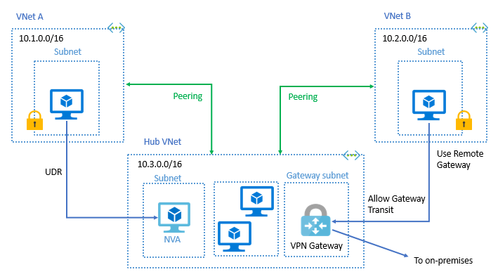
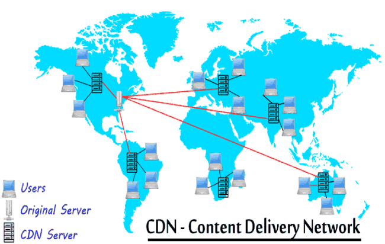
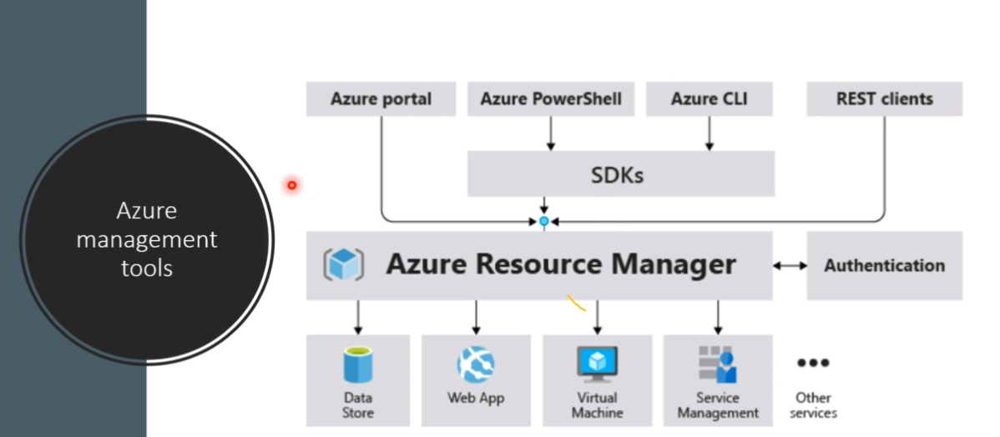
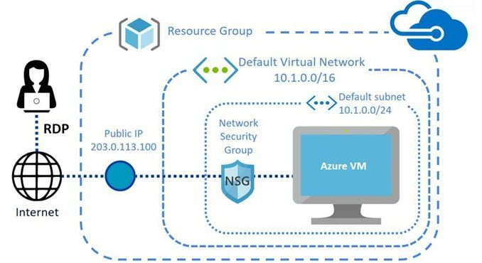
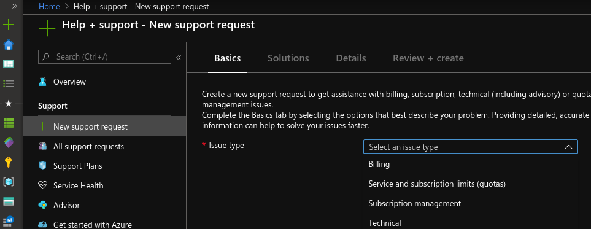
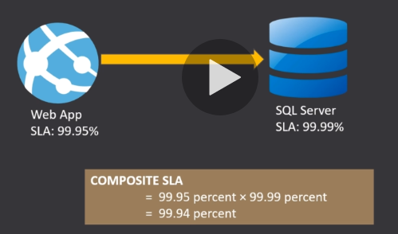

# Study Guide for Azure Certification az-900

Montei um guia de estudos com foco na certificação AZ-900 Fundaments da Azure. Os títulos (tópicos) e subtítulos estão em inglês para manter a mesma referência do que é cobrado mas dentro dos tópicos há conteúdo em português e inglês para facilitar a compreensão.

# Summary

**AZ-900: Understand Cloud Concepts (15-20%)**
## Describe the benefits and considerations of using cloud services

* Understand terms such as:
	* [High Availability](https://docs.microsoft.com/en-us/azure/architecture/checklist/availability)
	* Scalability
	* [Elasticity](https://azure.microsoft.com/en-ca/overview/what-is-elastic-computing/)
	* Agility
	* Fault Tolerance
	* [Disaster Recovery](https://docs.microsoft.com/en-ca/azure/site-recovery/site-recovery-overview)
* Understand the Principles of Economies of Scale [(PDF)](http://download.microsoft.com/download/6/e/4/6e4cb3d1-5004-4024-8d90-6c66c83c17aa/the_economics_of_the_cloud_white_paper.pdf)
* Understand the differences between:
	* Capital Expenditure (CapEx)
	* Operational Expenditure (OpEx)
* Understand the consumption-based model

## Describe the differences between Infrastructure-as-a-Service (IaaS), Platform-as-a-Service (PaaS) and Software-as-a-Service (SaaS)

* Describe [Platform-as-a-Service (PaaS)](https://azure.microsoft.com/en-ca/overview/what-is-paas/)
* Describe [Software-as-a-Service (SaaS)](https://azure.microsoft.com/en-ca/overview/what-is-saas/)
* Describe [Infrastructure-as-a-Service (IaaS)](https://azure.microsoft.com/en-ca/overview/what-is-iaas/)
* [Compare and contrast the 3 different service types](https://azure.microsoft.com/en-ca/overview/types-of-cloud-computing/)

## Describe the differences between Public, Private and Hybrid cloud models

* Describe [Public cloud](https://azure.microsoft.com/en-ca/overview/what-is-a-public-cloud/)
* Describe [Private cloud](https://azure.microsoft.com/en-ca/overview/what-is-a-private-cloud/)
* Describe [Hybrid cloud](https://azure.microsoft.com/en-ca/overview/what-is-hybrid-cloud-computing/)
* Compare and contrast the 3 different cloud models

**AZ-900: Understand Core Azure Services (30-35%)**

## Understand the core Azure architectural components

* Describe [Regions](https://azure.microsoft.com/en-ca/global-infrastructure/regions/)
* Describe [Availability Zones](https://docs.microsoft.com/en-us/azure/availability-zones/az-overview)
* Describe [Resource Groups](https://docs.microsoft.com/en-us/azure/architecture/cloud-adoption/getting-started/azure-resource-access#what-is-an-azure-resource-group)
* Describe [Azure Resource Manager](https://docs.microsoft.com/en-us/azure/azure-resource-manager/resource-group-overview)
* Describe the benefits and usage of core Azure architectural components

## Describe some of the core products available in Azure

* Describe products available for Compute such as:
	* [Windows Virtual Machines](https://docs.microsoft.com/en-ca/azure/virtual-machines/windows/overview) | [Linux Virtual Machines](https://docs.microsoft.com/en-ca/azure/virtual-machines/linux/overview)
	* [Virtual Machine Scale Sets](https://docs.microsoft.com/en-us/azure/virtual-machine-scale-sets/overview)
	* [App Service](https://docs.microsoft.com/en-us/azure/app-service/)
	* [Azure Functions](https://docs.microsoft.com/en-us/azure/azure-functions/functions-overview)
	* Azure Container Instsances (ACI)
	* Azure Kubernetes Service (AKS)
* Describe products available for Networking such as:
	* [Virtual Network](https://docs.microsoft.com/en-us/azure/virtual-network/virtual-networks-overview)
	* [Load Balancer](https://docs.microsoft.com/en-us/azure/load-balancer/load-balancer-overview)
	* [VPN Gateway](https://docs.microsoft.com/en-us/azure/vpn-gateway/vpn-gateway-about-vpngateways)
	* [Application Gateway](https://docs.microsoft.com/en-us/azure/application-gateway/overview)
	* [Content Delivery Network](https://docs.microsoft.com/en-us/azure/cdn/cdn-overview)
* Describe products available for Storage such as:
	* [Blob Storage](https://docs.microsoft.com/en-us/azure/storage/blobs/storage-blobs-overview)
	* [Disk Storage](https://docs.microsoft.com/en-us/azure/virtual-machines/windows/managed-disks-overview)
	* [File Storage](https://docs.microsoft.com/en-us/azure/storage/files/storage-files-introduction)
	* [Archive Storage](https://docs.microsoft.com/en-ca/azure/storage/blobs/storage-blob-storage-tiers)
* Describe products available for Databases such as:
	* [Azure Cosmos DB](https://docs.microsoft.com/en-us/azure/cosmos-db/introduction)
	* [Azure SQL Database](https://docs.microsoft.com/en-us/azure/sql-database/sql-database-technical-overview)
	* Azure Databsae for MySQL
	* Azure Database for PostgreSQL
	* [Azure Database Migration Service (DMS)](https://docs.microsoft.com/en-us/azure/dms/dms-overview)
	* [Azure Synapse Analytics (formerly SQL DW)](https://docs.microsoft.com/en-ca/azure/sql-data-warehouse/sql-data-warehouse-overview-what-is)
* Describe the [Azure Marketplace and its usage scenarios](https://azuremarketplace.microsoft.com/en-us/about)

## Describe some of the solutions available on Azure

* Describe [Internet of Things (IoT) and products](https://docs.microsoft.com/en-us/azure/iot-fundamentals/iot-services-and-technologies) that are available for IoT on Azure such as:
	* [IoT Fundamentals](https://docs.microsoft.com/bs-cyrl-ba/azure/iot-fundamentals/index)
	* [IoT Hub](https://docs.microsoft.com/en-ca/azure/iot-hub/about-iot-hub)
	* [IoT Central](https://docs.microsoft.com/en-ca/azure/iot-central/overview-iot-central)
* Describe Big Data and Analytics and products that are available for Big Data and Analytics such as:
	* [Azure Synapse Analytics (formerly SQL DW)](https://docs.microsoft.com/en-ca/azure/sql-data-warehouse/sql-data-warehouse-overview-what-is)
	* [HDInsight](https://docs.microsoft.com/en-ca/azure/hdinsight/)
	* [Azure Databricks](https://docs.microsoft.com/en-us/azure/azure-databricks/what-is-azure-databricks)
* Describe Artificial Intelligence (AI) and products that are available for AI such as:
	* [Azure Machine Learning Service](https://azure.microsoft.com/en-ca/services/machine-learning-service/)
	* [Azure Machine Learning Studio](https://azure.microsoft.com/en-ca/services/machine-learning-studio/) | [https://studio.azureml.net/](https://studio.azureml.net/)
* Describe Serverless computing and Azure products that are available for serverless computing such as:
	* [Azure Functions](https://docs.microsoft.com/en-us/azure/azure-functions/functions-overview)
	* [Logic Apps](https://docs.microsoft.com/en-ca/azure/logic-apps/logic-apps-overview)
	* Event grid
* Describe the benefits and outcomes of using Azure solutions

## Understand Azure management tools

* Understand Azure tools such as:
	* [Azure Portal](https://docs.microsoft.com/en-us/azure/azure-portal/azure-portal-overview)
	* [Azure PowerShell](https://docs.microsoft.com/en-us/powershell/azure/overview?view=azps-1.6.0)
	* [Azure CLI](https://docs.microsoft.com/en-us/cli/azure/?view=azure-cli-latest)
	* [Azure Cloud Shell](https://docs.microsoft.com/en-us/azure/cloud-shell/overview)

* Understand [Azure Advisor](https://docs.microsoft.com/en-us/azure/advisor/advisor-overview)

**AZ-900: Understand Security, Privacy, Compliance, and Trust (25-30%)**

## Understand securing network connectivity in Azure

* Describe [Network Security Groups (NSG)](https://docs.microsoft.com/en-us/azure/virtual-network/security-overview)
* Describe [Application Security Groups (ASG)](https://docs.microsoft.com/en-us/azure/virtual-network/security-overview#application-security-groups)
* Describe User Defined Rules (UDR)
* Describe [Azure Firewall](https://docs.microsoft.com/en-us/azure/firewall/overview)
* Describe [Azure DDoS Protection](https://docs.microsoft.com/en-us/azure/virtual-network/ddos-protection-overview)
* Choose an appropriate Azure security solution

## Describe core Azure Identity services

* Understand the difference between [Authentication and Authorization](https://docs.microsoft.com/en-us/azure/app-service/overview-authentication-authorization)
* Describe [Azure Active Directory](https://docs.microsoft.com/en-ca/azure/active-directory/fundamentals/active-directory-whatis)
* Describe [Azure Multi-Factor Authentication](https://docs.microsoft.com/en-us/azure/active-directory/authentication/concept-mfa-howitworks)

## Describe security tools and features of Azure

* Describe [Azure Security Center](https://docs.microsoft.com/en-us/azure/security/azure-security)
* Understand [Azure Security Center](https://docs.microsoft.com/en-ca/azure/security-center/security-center-intro) usage scenarios
* Describe [Key Vault](https://docs.microsoft.com/en-us/azure/key-vault/key-vault-whatis)
* Describe [Azure Information Protection (AIP)](https://docs.microsoft.com/en-us/azure/information-protection/what-is-information-protection)
* Describe [Azure Advanced Threat Protection (ATP)](https://docs.microsoft.com/en-us/azure-advanced-threat-protection/what-is-atp)

## Describe Azure governance methodologies

* Describe policies and initiatives with [Azure Policy](https://docs.microsoft.com/en-us/azure/governance/policy/overview)
* Describe [Role-Based Access Control (RBAC)](https://docs.microsoft.com/en-us/azure/role-based-access-control/overview)
* Describe [Locks](https://docs.microsoft.com/en-us/azure/azure-resource-manager/resource-group-lock-resources)
* Describe [Azure Advisor](https://docs.microsoft.com/en-us/azure/advisor/advisor-overview) security assistance
* Describe [Azure Blueprints](https://docs.microsoft.com/en-us/azure/governance/blueprints/overview)

## Understand monitoring and reporting options in Azure

* Describe [Azure Monitor](https://docs.microsoft.com/en-us/azure/azure-monitor/overview)
* Describe [Azure Service Health](https://docs.microsoft.com/en-ca/azure/service-health/)
* Understand the use cases and benefits of:
    * Azure Monitor
    * Azure Service Health

## Understand privacy, compliance and data protection standards in Azure

* Understand industry compliance terms such as:
    * [GDPR](https://www.microsoft.com/en-us/trustcenter/privacy/gdpr/gdpr-overview) | [More info](https://docs.microsoft.com/en-us/office365/securitycompliance/manage-gdpr-data-subject-requests-with-the-dsr-case-tool)
    * [ISO](https://www.microsoft.com/en-us/TrustCenter/Compliance/iso-iec-27018)
    * [NIST](https://www.microsoft.com/en-us/trustcenter/compliance/NIST_CSF)
* Understand the [Microsoft Privacy Statement](https://privacy.microsoft.com/en-ca/privacystatement)
* Describe the [Trust Center](https://www.microsoft.com/en-us/trustcenter/cloudservices/azure)
* Describe the [Service Trust Portal](https://servicetrust.microsoft.com/) | [Getting Started](https://docs.microsoft.com/en-us/office365/securitycompliance/get-started-with-service-trust-portal)
* Describe [Compliance Manager](/)
* Determine if Azure is compliant for a business need
* Understand [Azure Government cloud services](https://docs.microsoft.com/en-us/azure/azure-government/documentation-government-welcome)
* Describe Azure China cloud services

**AZ-900: Understand Azure Pricing and Support (20-25%)**

## Understand Azure Subscriptions

* Describe an [Azure Subscription](https://docs.microsoft.com/en-us/azure/architecture/cloud-adoption/getting-started/azure-resource-access#what-is-an-azure-subscription)
* Understand the uses and options with Azure Subscriptions such as:
    * Access Control
    * Offer Types
* Understand subscription management using Management Groups

## Understand planning and management of costs

* Understand options for purchasing Azure products and services
* Understand options around [Azure Free account](https://azure.microsoft.com/en-ca/free/free-account-faq/)
* Understand the factors affecting costs such as:
    * Resource Types
    * Services
    * Locations
    * Ingress traffic
    * Egress traffic
* Understand Zones for billing purposes
* Understand the [Pricing calculator](https://azure.microsoft.com/en-ca/pricing/calculator/)
* Understand the [Total Cost of Ownership (TCO) calculator](https://azure.microsoft.com/en-ca/pricing/tco/)
* Understand [best practices for minimizing Azure costs](https://docs.microsoft.com/en-us/azure/billing/billing-getting-started) such as:
    * Performing [Cost Analysis](https://docs.microsoft.com/en-us/azure/cost-management/quick-acm-cost-analysis)
    * Creating [spending limits](https://docs.microsoft.com/en-us/azure/billing/billing-spending-limit) and [quotas](https://docs.microsoft.com/en-us/azure/azure-subscription-service-limits)
    * [Using tags to identify cost owners](https://docs.microsoft.com/en-us/azure/azure-resource-manager/resource-group-using-tags)
    * Using [Azure reservations](https://azure.microsoft.com/en-ca/reservations/)
    * Using [Azure Advisor recommendations](https://docs.microsoft.com/en-ca/azure/advisor/advisor-overview)
* Describe [Azure Cost Management](https://docs.microsoft.com/en-us/azure/cost-management/overview-cost-mgt)

## Understand the support options available with Azure

* Understand [support plans](https://azure.microsoft.com/en-ca/support/plans/) that are available such as:
    * [Developer](https://azure.microsoft.com/en-ca/support/plans/developer/)
    * [Standard](https://azure.microsoft.com/en-ca/support/plans/standard/)
    * [Professional Direct (ProDirect)](https://azure.microsoft.com/en-ca/support/plans/prodirect/)
    * [Premier](https://azure.microsoft.com/en-ca/support/plans/premier/)
* Understand [how to open a support ticket](https://azure.microsoft.com/en-ca/support/create-ticket/)
* Understand [available support channels outside of support plan channels](https://azure.microsoft.com/en-ca/support/faq/)
* Describe the [Knowledge Center](https://azure.microsoft.com/en-us/resources/knowledge-center/)

## Describe Azure Service Level Agreements (SLAs)

* Describe a [Service Level Agreement (SLA)](https://azure.microsoft.com/en-ca/support/legal/sla/)
* Understand Composite SLAs
* Understand how to determine an appropriate SLA for an application

## Understand service lifecycle in Azure

* Understand Public Preview features
* Understand [Private Preview features](https://azure.microsoft.com/en-ca/support/legal/preview-supplemental-terms/)
* Understand the term General Availability (GA)
    * GA means a service is in production and can be used by anyone with an Azure subscription
* Understand how to [monitor feature updates and product changes](https://azure.microsoft.com/en-ca/updates/)

**Uselful Links**
    - Simulates
        - https://www.udemy.com/course/simulado-certificacao-az-900/
        - https://www.udemy.com/course/simulado-para-a-prova-az-900/
    - Tranning
        - https://www.udemy.com/course/introducao-ao-microsoft-azure-certificacao-az-900/
        - https://www.udemy.com/course/microsoft-azure-beginners-guide/
        - https://docs.microsoft.com/en-us/learn/paths/azure-fundamentals/
        - https://github.com/AzureMentor/Azure-AZ-900-Study-Guide
    - Link for Test
        - https://wsr.pearsonvue.com/testtaker/registration/Dashboard/MICROSOFT
    - How the test works ?
        - https://www.youtube.com/watch?v=Vb0OGIH-2MM&list=PLahhVEj9XNTceGnF19qSjYxYzS4S_Wlmf&index=2&t=0s
        - https://www.youtube.com/watch?v=k9qDZ4gnjtA
    - English Trainning
        - https://www.udemy.com/course/curso-de-ingles-para-ti/
- Schedule
    - Sunday: overview
    - Monday: Understand core Azure services (35%)
    - Tuesday: Understand core Azure services (35%)
    - Wednesday: Understand security, privacy, compliance, and trust (30%)
    - Thursday: Understand security, privacy, compliance, and trust (30%)
    - Friday: Understand Azure Pricing and Support (25%)
    - Saturday: Review

---

# Resume
## AZ-900: Understand Cloud Concepts (20%)

### Cloud Concept
- Scalability
 - scaling up: vertical
 - caling out: horizontal
 - _can expand its size when there are more users in the system_

- Elasticity
 - _can shrink its size when there are fewer users in the system_
 - _can also set automatic shutdown during the non-business hours to save money_

### [Capital expenditure (CapEx) versus operational expenditure (OpEx)](https://docs.microsoft.com/en-us/learn/modules/principles-cloud-computing/3c-capex-vs-opex)
O Capital expenditure garante custos fixos para compras a longo prazo. Isto torna a melhor escolha quando o budget é limitado.
- CapEx computing costs
 - Server
 - Storage
 - Network
 - Backup
 - disaster recovery
 
O operational expenditure são custos de curto prazo.
- _OpEx cloud computing costs_
  - _Leasing software_
  - _usage/demand instead of fixed hardware_
  - _Billing at the user or organization level_

Quando não se sabe a demanda e _growth_ a melhor escolha é o OpEx

### IaaS, PaaS and SaaS

###  Difference between public, private and hydrid cloud
The cloud deployment model you choose depends on your budget, and on your security, scalability, and maintenance needs.

#### Public Cloud
Microsoft Azure is an example of a public cloud provide

Advantages
- High scalability/agility 
- Pay-as-you-go pricing – you pay only for what you use, no CapEx costs
- You're not responsible for maintenance or updates of the hardware

Disavantages
- specific security requirements 
- You don't own the hardware or services and cannot manage them as you may want 

Question: You are running a virtual machine in a public cloud using IaaS. Which model correctly reflects how that resource is managed?
 
shared responsibility: The cloud provider being responsible for the cloud services infrastructure and the end user being responsible for the service being configured and managed correctly.

#### Private Cloud
You create a cloud environment in your own datacenter.

Advantages
- You have control (and responsibility) over security
- You can ensure the configuration can support any scenario or legacy application

Disavantages
- You have some initial CapEx costs and must purchase the hardware for startup and maintenance
- Owning the equipment limits the agility - to scale you must buy, install, and setup new hardware

#### Hybrid Cloud
A hybrid cloud combines public and private clouds, allowing you to run your applications in the most appropriate location.

Advantages
- You have flexibility with what you run locally versus in the cloud
- You can use your own equipment to meet security

Disavantages
- It can be more complicated to set up and manage
- You have some initial CapEx costs

---

## Understand core Azure services (35%)
### Architectural
  - [Regions](#regions)
  - [Avaialibility Zones](#avaialibility-zones)
  - [Resource Groups](#resource-groups)
  - [Resource Manager](#resource-manager)

#### Regions
- É uma área geográfica.
- Pode posuir vários datacenters
- A própria Azure faz o balanceamento de resources.

- A Azure é o cloud provider com mais regions no mundo. Isso provê melhor scalability e  redundancy.
- Não é gerado poluição de carbono e a energia vem de fontes renováveis.
- É o menor grão dos recursos físicos que o usuário pode escolher.

#### Avaialibility Zones
- São datacenters separados em uma mesma region.
- Há um mínimo 3 zones dentro de uma única region

#### Resource Group

É um agrupador lógico de _resources_ onde é possível aplicar políticas de acesso.

#### Resource Manager (ARM)
- É um serviço que faz o _deploy_ e _management_ de resource na Azure.
- Parecido com chef, ansible (não tem estado)

### Describe some of the core products available in Azure
 - Environments
   - [VM](#vm)
   - [VM scale](#vm-scale)
   - [Service Functions](#service-functions)
   - [Container Instance](#container-instance)
   - [Kubernetes Service](#kubernets-services)
 - Network
   - [Virtual Network](#)
   - [Load Balancer](#)
   - [VPN Gateway](#)
   - [Application Gateway](#)
   - [Content Delivery Network](#)
 - Storage
   - [Blob Storage](#)
   - [Disk Storage](#)
   - [File Storage](#)
   - [Archive Storage](#)
 - [Azure Marketplace](#)

#### Service Functions
...

#### VM
VM são as máquinas virtuais linux e windows. Se for produtos como windows server ou sql server, a Azure se torna 5x mais barata que a AWS.

#### VM Scale Set
VM scale faz um scaling up ou scaling out automático. Quando a carga de trabalho cai, o próprio serviço se encarrega de excluir as VMs não utilizadas (_elatic_).

#### Load Balancer

#### Virtual Network (Vnet)
- É um isolamento lógico de _network_ na Azure no escopo de uma [region](#region).

- Permite definir os private IPs. Tambem é possível criar VNets com o mesmo espaço de endereço em duas regiões diferentes (por exemplo, Leste dos EUA e Oeste dos EUA)
- Você pode vincular uma rede virtual a uma rede local por meio de um gateway VPN
- Advantages
  - segurança
  - isolamento
  - políticas de tráfego
- _Secure your VNet using Network Security Groups (NSGs)_
**Question: You plan to deploy 20 virtual machines to an Azure environment. To ensure that a virtual machine named VM1 cannot connect to the other virtual machines, VM1 must ***be deployed to a separate virtual network***

**Question: You have an Azure environment that contains 10 virtual networks and 100 virtual machines.You need to limit the amount of inbound traffic to all the Azure virtual networks.**

#### Application Gateway
**É um load balancer que gerencia o tráfego baseado em rota (URL)**.
NOTE: o Azure Load Balancer tambem gerencia o trágefo mas se basea em IP.

#### VPN Gateway
- É um tunelamento de um _virtual network_ que encripta o tráfego entre a cloud e o ambiente local.
- A VPN gateway is a specific type of virtual network gateway that is used to send encrypted traffic between an Azure virtual network and an on-premises location 
- Each virtual network can have only one VPN gateway

#### Content Delivery Network (CDN) 
Uma _delivery network_ de conteúdo é uma rede de servidores que armazena conteúdo de alguma coisa da web em cache para os usuários em sua borda, ou seja, o usuário não precisa ir até o servidor principal para obter o conteúdo, basta acessar a CDN mais próxima (de menor latência).

#### SQL Database
O servico de SQL database exige que seja configurado um servidor.

#### Cosmos DB
É schema-less data, ideal para dados semi-estruturados (json, por exemplo).

#### Blob Storage 'S3'
É para grande quantidade de dados unstructured.

#### Blob Storage Cold 'S3 Glacier'
- Otimizado para dados que são acessado com pouca frequência (30 dias)
- **OS custos de armazenamento são mais baixos e custos de acesso mais altos em comparação com o hot tier**.
- NOTE: deletion period of 30 days.

#### Archive Storage 'S3 Glacier'
- Serve para armazenar dados que rarely são acessados (180 dias). É muito útil para backup e recovery.
- NOTE: deletion period of 180 days.

#### File Storage
Compartilha arquivos via **protocolo SMB**

#### Disk Storage
Serve para storage de disco de VM. Em uma VM é permitido somente 1 disco por vez, então é possível utilizar o Disk Storage para virtualizar outro disco.

#### Azure Marketplace
É um lugar que apresenta soluções de _partners_ da Azure. É possível decobrir e comprar soluções para serem provisionadas na Azure. Ex, VMs personalizadas, databases, developer tools.

#### Why to use Azure Data Services?
- Automated backup and recovery
- Replication accors the globe
- Support for data analytcs
- Encryption
- Storage tiers

## Tools

**Azure Dashboard**: can be exported `json`

---

# Understand security, privacy, compliance, and trust (30%)
- Network Security Groups (NSG)
- Application Security Groups (ASG)
- User Defined Rules (UDR)
- Azure Firewall
- Azure DDoS Protection
- Choose an appropriate Azure security solution 
- Understand the difference between authentication and authorization
- Azure Active Directory
- Azure Multi-Factor Authentication
- Azure Security Center
- Key Vault
- Azure Information Protection (AIP)
- Azure Advanced Threat Protection (ATP)
- Azure Monitor
- Azure Service Health
- Understand the use cases and benefits of Azure Monitor and Azure Service Health

**Network Security Groups (AWS = VPC)**: 
- A security group acts as a virtual firewall 
- This services filter network traffic
- **contains a list of security roles** about control inbound and outbound network traffic. Network Security Groups can be associated to subnets, VM and NICs.

**Application Security Groups**
- Application security groups enable you to configure network security as a natural extension of an application'

- Not need explict IP address

**Azure Firewall**
- Network Security Group and Application Security Group not match pattern our identify traffic

- It's a fully stateful firewall as a service with built-in high availability and unrestricted cloud scalability.
- Integrated with Azure Monitor for logging and analytics.

**Azure DDos Protection**
- Distributed denial of service
- A DDoS attack attempts to exhaust an application’s resources, making the application unavailable to legitimate users. 
- Clear network edge before impact application.
- Azure DDoS protection, combined with application design best practices, provide defense against DDoS attacks.
- Application layer 

##  Azure Identity services
**Authentication**
Authentication is the process of **estabilishing the identity** of a person or service loking to access a resource.

**Authorization**
Authorization is the process of estabilishing what **level of access** an authenticated person or service has.

**Azure Active Directory**
Identity and access management service. Also do:
- business to business (B2B) identity services
- business to costumer (B2C) identity services

## security tools and features of Azure
**Azure Security Center**

- Is a monitoring service that provides threat protection across all of your services in Azure and on-premises. 
- Use machine learning to deteck and block malwares
- Azure Security Center is a unified infrastructure security management system 

- Can do:
  - provide recommendations based on configurations, resources and network
  - monitor security settings 

- Usage scenrios
 - For incident response
 - Recommendations fo enhance security (melhorar a segurança)

**Advanced Threat Protection**
Cloud-based that identifies, detects and helps investigate to 
 - advanced threats (ameaças)
 - compromised identities
 - malicious insider actions (ações maliciosas)

Advanced
- Monitor profile user how activities and behavior
- Identify suspicious activities
- Protect user identities and reduce the attack surface

**Azure Information Protection**
Help organizations classify and protect documents and email with labels.

### Understand monitoring and reporting options in Azure

**Azure Monitor and Azure Service Health**
Azure Monitor monitora, analisa dados e execução ações encima de alertas criados. Já o Azure Service Health mostra a saúde da Azure onde é possível ver as manutenções preventivas e se há algum incidente.

### Azure governance methodologies
São ferramentas que a Azure tem para gerenciar subscriptions.
- Azure policy
- Role-based access control
- Lock
- Blueprints (conjuntos repetitíveis de recursos)

**Azure policy**
Allow create, assing and manage polices over resources.

**Role-based access control**
Controla o nível de autorização por usuário.

**Locks**
- Lock resources to prevent unexpected changes
- É um serviço para que quando um usuário tenha acesso a um recurso só possa executar algumas funções.
- Ajuda a previnir exclusão acidental (canNotDelete) ou limitar a somente leitura (readOnly) algum usuário.

**[Azure Blueprints](https://docs.microsoft.com/en-us/azure/governance/blueprints/overview)**
- É um RM que guarda estado.
- define a repeatable set of Azure resources
- O serviço foi projetado para ajudar na configuração do ambiente . - Essa configuração geralmente consiste em um conjunto de grupos de recursos, políticas, atribuições de função e implantações de modelo do Resource Manager.

- É uma forma declarativa de orquestrar a implatação de recursos que segue a ordem:
1. Role assignment
2. Policy assignment 
3. ARM template 

-  different from Resource Manager templates: RM é um documento que não existe nativamente no Azure não há conexão ou relacionamento ativo com a modelagem feita, ou seja, não guarda estado.
Com o Blueprints, o relacionamento entre a definição do blueprint (o que deve ser implantado) e a atribuição do blueprint (o que foi implantado) é preservado.

---

## Understand Azure pricing and support (20-25%)

**Azure Subscritpions**
- Is a logical container used to provision resource.
- Azure subscription is associated with Azure AD.

**Subscription Types**
- Free
  - $ 200 for 30 day
  - started with 12 months of free services
- Student
  - $ 100 for 12 months
- Pay-as-you-go
- Enterprise Agreement: ideal para empresas que contratam serviços em nuvem e licenças de software, como office, sob um único contrato, o que garante descontos.

**[Management Groups](https://docs.microsoft.com/en-us/azure/governance/management-groups/overview)**
These groups are containers that help you manage access, policy, and compliance for multiple subscriptions.

- Ex: You can create a hierarchy that applies a policy, for example, which limits VM locations to the US West Region

**[Object Hierarchy](https://docs.microsoft.com/en-us/azure/cloud-adoption-framework/ready/azure-setup-guide/organize-resources?tabs=AzureManagmentGroupsAndHierarchy)**

**[Azure Support Options](https://azure.microsoft.com/en-us/support/plans/)**

Features:
- Para ter suporte com um desenvolvedor da Azure é necessário pagar o suporte **premier**
- o suporte **developer** não esta disponível para empresas 

**Knowledge Center**
- É um stackoverflow para azure
- é um banco de dados que contém perguntas e repostas da comunidade.

**How to open a support ticket**

## SLA
- O sla expecifica o que acontece se um serviço falhar. Por exemplo, em caso de falhas o cliente pode ganhar descontos (service credits)
- sla geral da Azure: 99,9%

## Service-Level Agreements
Há 3 keys no SLA da Azure:
1. Performance product and services.
2. Uptime and Connectivity Guarantees (99 until 99.999)
3. Service credits. Azure apply discount to as compensation for an under-performing product and services.

### Application availability
- Referese ao tempo global (overral time) que o sistema esta trabalhando.

---

## Author
- Bruno Aurélio Rôzza de Moura Campos (brunocampos01@gmail.com)

## Copyright
 This work by Bruno A. R. M. Campos is licensed under a <a rel="license" href="http://creativecommons.org/licenses/by-sa/4.0/">Creative Commons Attribution-ShareAlike 4.0 International License</a>.
